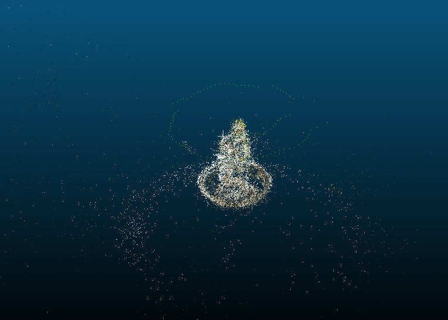
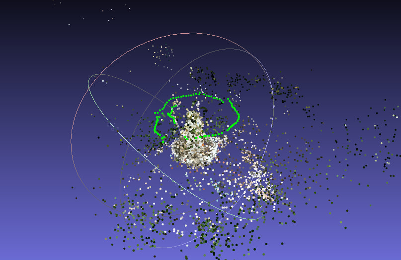

# reconstructor

This project is aimed for 3d reconstruction(sparse up-to scale cloud + camera positions) using camera images. The focus of the whole project is on symbiosis between learning-based approaches and time-proven classic algorithms. Inspired by existing open-source approaches: Colmap, AliceVision, OpenMVG.

# reconstructor features

At the moment there is cpp a wrapper over SuperPoint(https://github.com/magicleap/SuperPointPretrainedNetwork), 
also a cpp wrapper over SuperGlue matcher(https://github.com/magicleap/SuperGluePretrainedNetwork)

# reconstructor results:

Fountain dataset. Taken from kaggle's image matching 2023 competition.

There is also corresponding cloud_fountain.ply file. It might be opened via Meshlab(renders colored pointcloud) or CloudCompare(renders uncolored pointcloud) or any other cloud viewer. Camera poses are visualized as green points.

# what is done at the moment

1. 2 feature extractors: SuperPoint, ORB + BaseClass for possible extension
2. 2 feature matchers: SuperGlue, Flann + BaseClass for possible extension
3. Feature filtering(based on epipolar geometry)
4. Initial img pair choice and initial triangulation
5. Separate class for end2end reconstruction
6. Img matcher(which for now assumes all images are matched)
7. 3d visualization of reconstructed cloud(up to scale) + camera positions
8. incremental reconstruction via pnp + BA
9. colored pointcloud, saved in *.ply format
10. use openmp/tbb to make it faster

# todo:

1. code refactoring + add comments
2. Add saving of intermediate steps(feature detection, image matching, feature matching) to avoid their computation in case of changes only in sfm part
3. image matcher(apply some image retrieval, FAISS, metric learning)

# todo later:

1. use monocular depth estimating networks(for example https://github.com/isl-org/MiDaS) to obtain real scale and dense reconstruction

# some notes on openmp:

It is currently added for feature extraction + feature matching + matches saving. Here are some results on sift + flann for 100 images(duration in seconds):

* Openmp 4 threads + collapse(on double for): (7 + 76 + 171)
* Without openmp : (7 + 180 + 406)  

# how to run

1. install OpenCV 4.2+  https://docs.opencv.org/4.x/d7/d9f/tutorial_linux_install.html
2. install libTorch https://pytorch.org/, choose Language: C++/Java, only CPU platform tested at the moment
3. install PCL https://pointclouds.org/downloads/
4. clone this repo and change path to libtorch in CMakeLists.txt "CMAKE_PREFIX_PATH"
5. `mkdir build && cd build`
6. `cmake .. && make`
7. run `./reconstruct`

